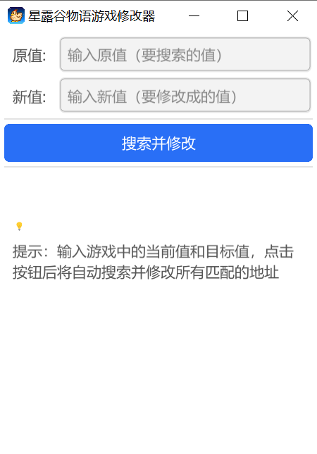
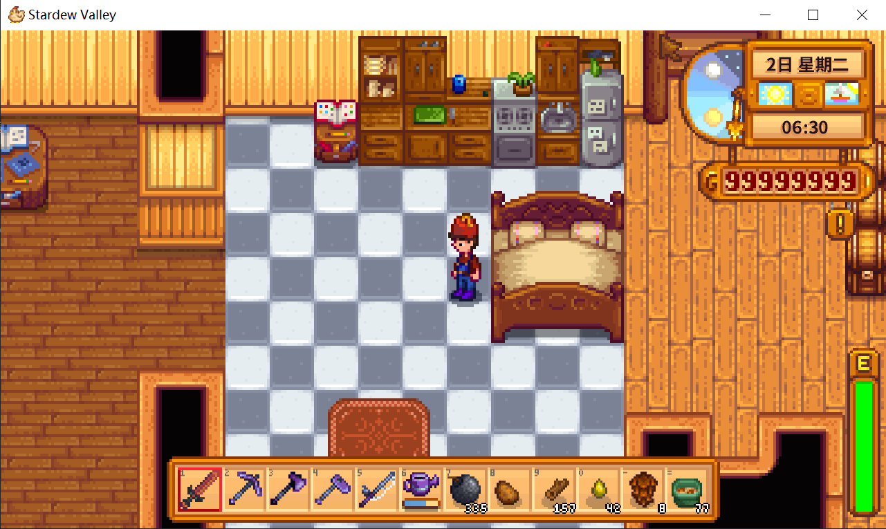

# 游戏修改器

这是一个基于Go语言和Fyne GUI框架开发的游戏修改器，可以查询和修改游戏中的数值。

## 🎉 最新更新

**界面已从Web迁移到原生GUI！**
- ✅ 不再需要浏览器访问
- ✅ 更流畅的用户体验
- ✅ 原生桌面应用界面
- ⚠️ 需要安装GCC编译器（详见INSTALL.md）

## 功能特性

- 查找并打开目标游戏进程
- 搜索游戏中的特定数值
- 修改内存中的数值
- 图形用户界面操作
- 支持多次搜索精确定位

## 📸 截图展示

### 游戏修改器界面



### 游戏效果展示（星露谷物语）



> 💡 上图为使用本工具修改星露谷物语金币数值后的效果展示

## 技术栈

- Go 1.24+
- Fyne v2.5.0 GUI框架
- Windows API（用于进程内存操作）

## 快速开始

### 前置要求

1. **Go语言环境**：Go 1.21或更高版本
2. **GCC编译器**：Windows上编译Fyne应用必需（详见 [INSTALL.md](INSTALL.md)）

### 安装依赖

```bash
go mod tidy
```

### 编译程序

**方式一：使用构建脚本（推荐）**
```bash
.\build.bat
```

**方式二：手动编译**
```bash
# 首次编译需要先捆绑图标资源
fyne bundle -package main -name appIcon icon.png | Out-File -FilePath bundled.go -Encoding utf8

# 编译程序（无控制台窗口）
go build -ldflags="-H windowsgui" -o bling.exe .

# 或者带控制台窗口（用于调试）
go build -o bling.exe .
```

### 运行程序

**重要：本程序需要管理员权限才能修改其他进程的内存！**

**直接双击 `bling.exe` 即可**
- 程序会自动弹出 UAC（用户账户控制）提示框
- 点击“是”后，程序即以管理员权限运行
- 无需手动右键选择“以管理员身份运行”

## 使用说明

### 基本流程

1. **以管理员身份运行程序**（重要！）
   - 右键点击 `game-modifier.exe`
   - 选择"以管理员身份运行"

2. **选择进程**
   - 在"输入进程名称"框中输入目标游戏的进程名（例如：notepad.exe）
   - 点击"查找进程"按钮

3. **首次搜索**
   - 在游戏中记住要修改的数值（例如：金币数量 100）
   - 在"输入要搜索的值"框中输入该数值（例如：100）
   - 点击"首次搜索"按钮
   - 等待扫描完成，下方会显示找到的所有地址

4. **再次搜索（缩小范围）**
   - 在游戏中改变该数值（例如：花费一些金币，变成 90）
   - 在"输入要搜索的值"框中输入新数值（例如：90）
   - 点击"再次搜索"按钮
   - 重复直到只剩少数几个地址

5. **修改数值**
   - 在地址列表中点击想要的地址（会自动填入地址框）
   - 在"新值"框中输入想要修改的数值
   - 点击"修改值"按钮完成修改

### 提高搜索成功率的技巧

1. **精确搜索**：
   - 第一次搜索后，如果找到太多地址，在游戏中改变数值
   - 然后用新数值再次搜索，逐步缩小范围

2. **选择正确的数据类型**：
   - 当前版本仅支持 32位整数 (int32)
   - 如果搜索不到，可能是游戏使用了其他类型（float、double等）

3. **暂停游戏**：
   - 搜索时尽量暂停游戏，防止数值变化

4. **多次验证**：
   - 找到地址后，先读取验证是否正确
   - 然后再进行修改

## 常见问题

### Q: 为什么搜索不到数值？

**A:** 可能有以下原因：

1. **数据类型不匹配** - 游戏可能使用 float、double 或其他类型，而不是 int32
2. **数值已加密** - 某些游戏会对数值进行加密存储
3. **动态内存** - 游戏可能使用指针或动态分配的内存
4. **服务器端验证** - 在线游戏的数值存储在服务器上，无法修改
5. **未以管理员身份运行** - 必须右键选择"以管理员身份运行"

### Q: 找到太多地址怎么办？

**A:** 使用"多次搜索"策略：
1. 第一次搜索后记录所有地址
2. 在游戏中改变该数值
3. 用新数值再次搜索
4. 重复直到只剩少数几个地址

### Q: 修改后没有效果？

**A:** 可能原因：
1. 修改了错误的地址（需要验证）
2. 游戏有反作弊机制
3. 数值是服务器控制的
4. 需要修改多个相关地址

### Q: 编译时提示"build constraints exclude all Go files"？

**A:** 这是因为没有安装GCC编译器。请查看 [INSTALL.md](INSTALL.md) 了解如何安装。

### Q: 扫描速度很慢？

**A:** 这是正常的，因为需要遍历整个进程内存空间。优化建议：
- 关闭不必要的程序
- 选择较小的目标进程
- 耐心等待扫描完成

## 注意事项

- **重要**: 本程序需要以管理员身份运行才能访问其他进程的内存
- **重要**: Windows系统需要安装GCC编译器才能编译（详见 [INSTALL.md](INSTALL.md)）
- 本程序仅用于学习和研究目的
- 使用游戏修改器可能违反某些游戏的服务条款
- 请负责任地使用本工具
- 如果遇到"Access is denied"错误，请以管理员身份重新运行程序

## 更多帮助

详细的安装和故障排除指南，请查看 [INSTALL.md](INSTALL.md)

## 开发经验总结

### 自动请求管理员权限方案

为了让程序在启动时自动弹出 UAC 提示框请求管理员权限，我们使用了 Windows manifest 文件：

**步骤 1：创建 manifest.xml 文件**
```xml
<?xml version="1.0" encoding="UTF-8" standalone="yes"?>
<assembly xmlns="urn:schemas-microsoft-com:asm.v1" manifestVersion="1.0">
  <trustInfo xmlns="urn:schemas-microsoft-com:asm.v3">
    <security>
      <requestedPrivileges>
        <requestedExecutionLevel level="requireAdministrator" uiAccess="false"/>
      </requestedPrivileges>
    </security>
  </trustInfo>
</assembly>
```

**步骤 2：编译时嵌入 manifest**
```bash
# 安装 rsrc 工具（首次需要）
go install github.com/akavel/rsrc@latest

# 生成资源文件
rsrc -manifest manifest.xml -o rsrc.syso

# 编译程序
go build -ldflags="-H windowsgui" -o bling.exe .
```

**工作原理：**
- `rsrc` 工具将 manifest 转换为 Windows 资源文件 (.syso)
- Go 编译器会自动将所有 .syso 文件链接到可执行文件中
- Windows 在启动程序时会读取 manifest，发现需要管理员权限后自动弹出 UAC 提示

**效果：**
- 用户双击 `bling.exe` 时，立即弹出 UAC 提示框
- 无需手动右键选择“以管理员身份运行”
- 用户体验更好，更专业

### 图标集成方案

本项目使用 Fyne 的资源捆绑功能来嵌入应用图标，无需额外工具：

```bash
# 1. 生成资源文件（首次编译或更换图标时执行）
fyne bundle -package main -name appIcon icon.png | Out-File -FilePath bundled.go -Encoding utf8

# 2. 在代码中使用嵌入的图标
myWindow.SetIcon(appIcon)  # 设置窗口图标
```

**注意事项：**
- `bundled.go` 是自动生成的文件，不要手动编辑
- 如果更换了 `icon.png`，需要重新运行 `fyne bundle` 命令
- 图标会被直接编译到 exe 文件中，无需分发额外的图片文件

### 编译命令说明

```bash
# 无控制台窗口（发布版本）
go build -ldflags="-H windowsgui" -o bling.exe .

# 带控制台窗口（调试版本）
go build -o bling.exe .
```

**参数解释：**
- `-ldflags="-H windowsgui"`：隐藏控制台窗口，适用于纯 GUI 应用
- `-o bling.exe`：指定输出文件名
- `.`：编译当前目录下的所有 Go 文件（包括 bundled.go）

### 常见问题

**Q: 编译时提示找不到 bundled.go？**  
A: 确保先运行 `fyne bundle` 命令生成资源文件。

**Q: 图标没有显示？**  
A: 检查以下几点：
1. 确认已运行 `fyne bundle` 生成最新的 bundled.go
2. 确认代码中使用了 `myWindow.SetIcon(appIcon)`
3. 重新编译程序
4. Windows 可能会缓存图标，尝试重启程序或清除图标缓存

**Q: bundled.go 出现编码错误？**  
A: 使用 PowerShell 的 `Out-File -Encoding utf8` 确保正确的文件编码。